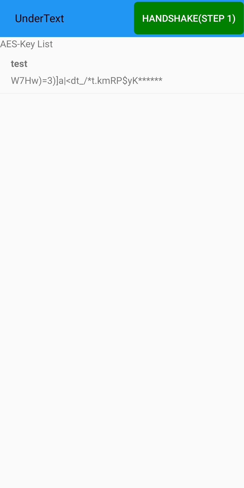
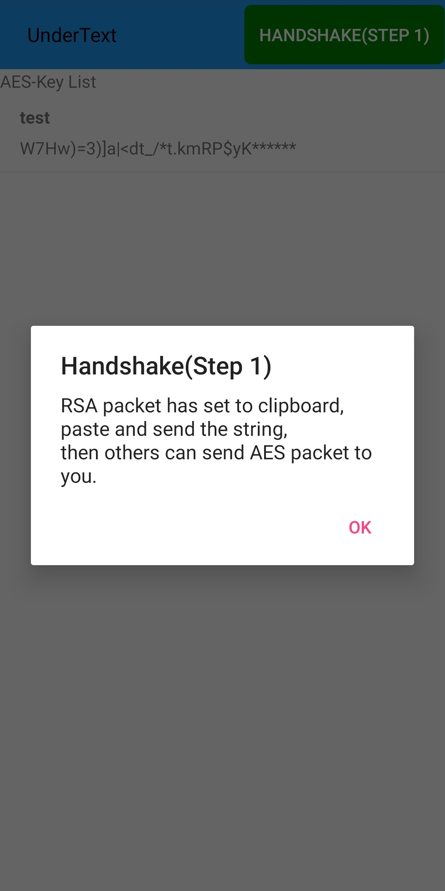
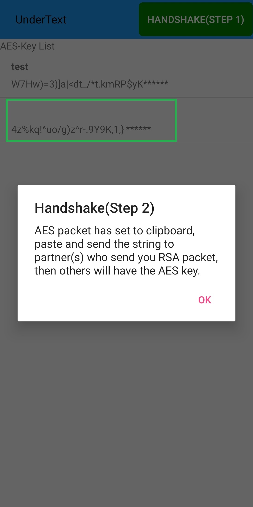
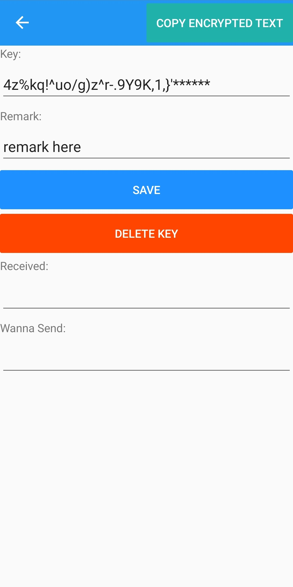
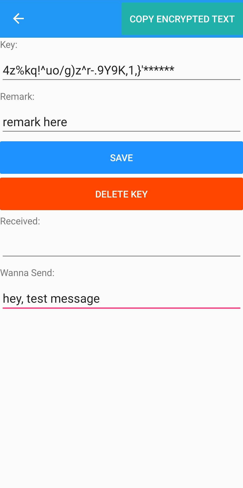
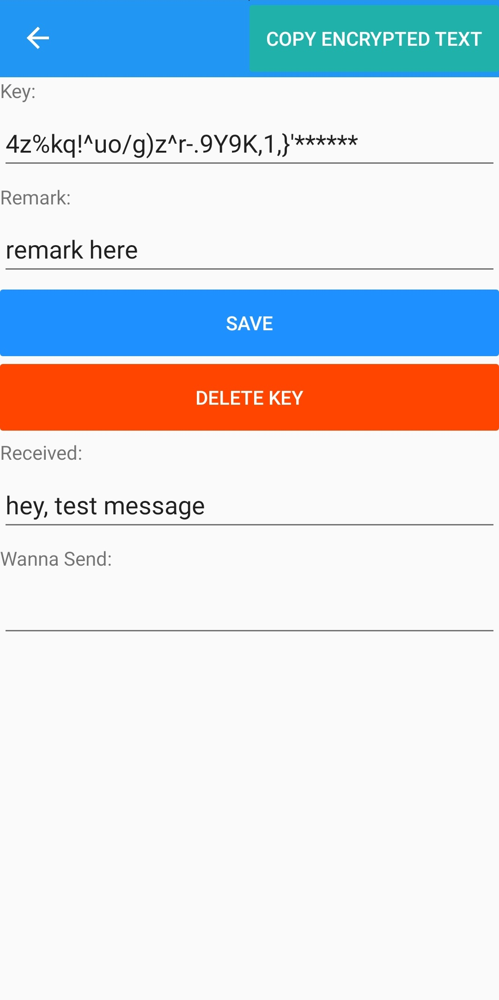

# UnderText

> Encrypt & decrypt text to exchange messages through unreliable network

## Introduction

UnderText use RSA-2048 to switch AES key, and AES-256 to encrypt text.

Assume that two people A and B wanna exchange some messages through a public channel may be established by others, A and B can use UnderText to switch AES key and exchange encrypted text.

Make it clear:

1. `A` generate RSA-2048 public key and private key, then use base64 to encode RSA-2048 public key as `PK`, and `A` send `PK` to `B`.
2. `B` receive `PK` from `A`, then `B` generate AES-256 key and encrypt the AES key with `PK`, then encode the encrypted AES key with base64 as `AK`, `B` send `AK` to `A`.
3. `A` receive `AK` from B, use RSA-2048 private key to decrypt `AK` to get the decrypted AES-256 key. So now, both `A` and `B`  has AES-256 key.
4. `A` and `B` use AES-256 key to encrypt and decrypt text messages.

## Usage

1. Send handshake(`Person A`)

   
   
   Press `HANDSHAKE(STEP 1)` button, this app will set the first handshake string to your clipboard:
   
   
   
   Then, you can paste the string, and send the string to your partner.
   
2. Partner receive Handshake string and send AES packet(`Person B`)

   Partner copy the handshake string, then switch to UnderText, the app will parse the handshake string automatically, and the AES key generated will be appended to the list.
   
   
   
   Follow the tip, paste and send AES packet string to the partner who sent you the handshake string. 
   
3. Receive AES packet string(`Person A`) and Send encrypted message to others(`Person A & Person B`)

   Copy the AES packet string, then switch to UnderText, the app will parse the  AES packet string automatically, and the AES key received will be appended to the list. At the same time, the page of AES key appear like this:
   
   
   
   In this page, you can set the remark of this AES key, delete this key, and encrypt text by this key.
   
   To encrypt a text message, input what you want under `Wanna Send`, then press the button `COPY ENCRYPTED TEXT`, the encrypted message is set to your clipboard, paste and send the string to your partner.
   
   
   
4. Receive encrypted message and decrypt(`Person A & Person B`)

   

   Copy the encrypted message and switch to UnderText app, the decrypted message will show.
